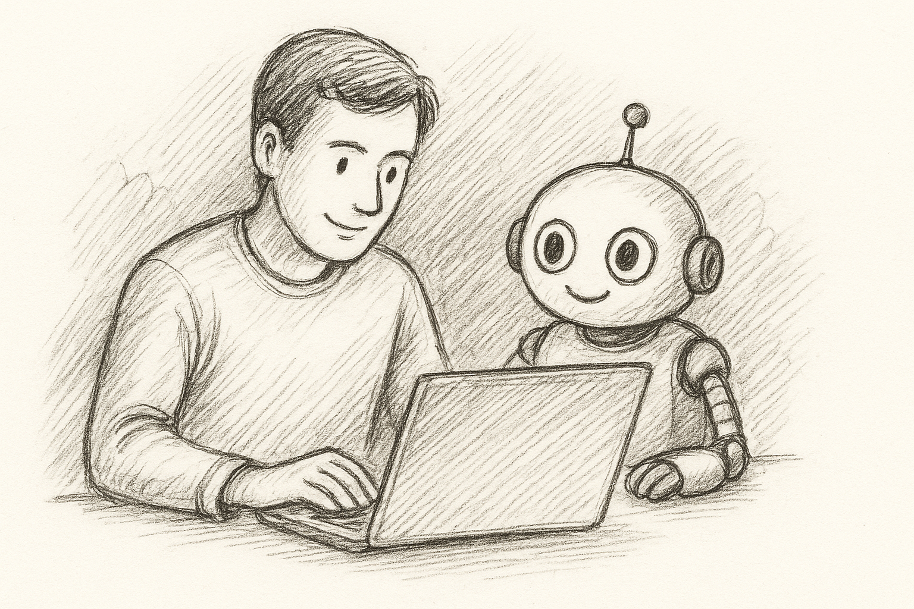
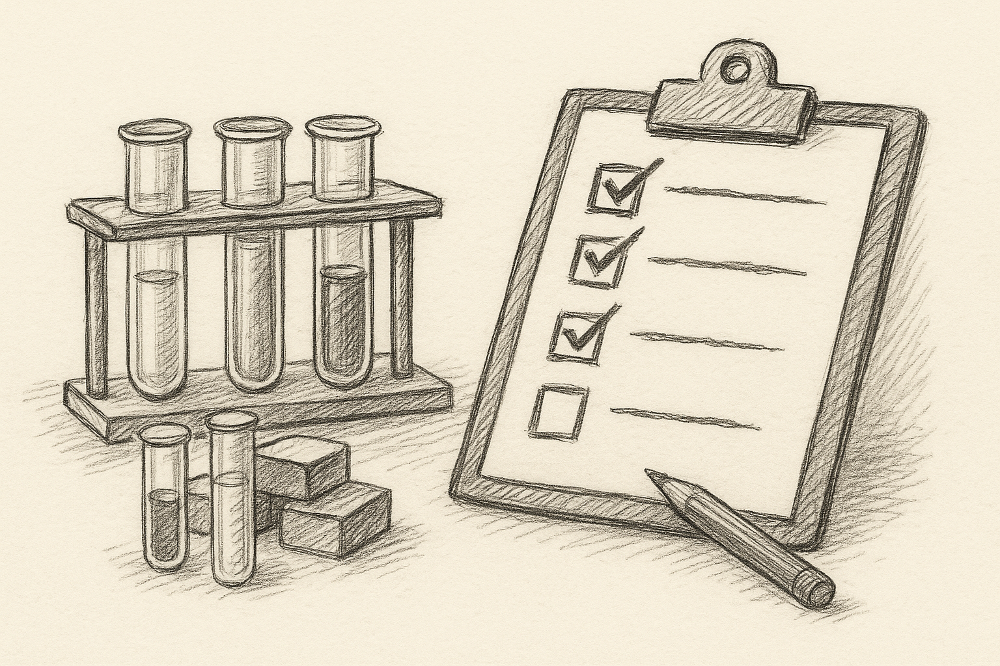
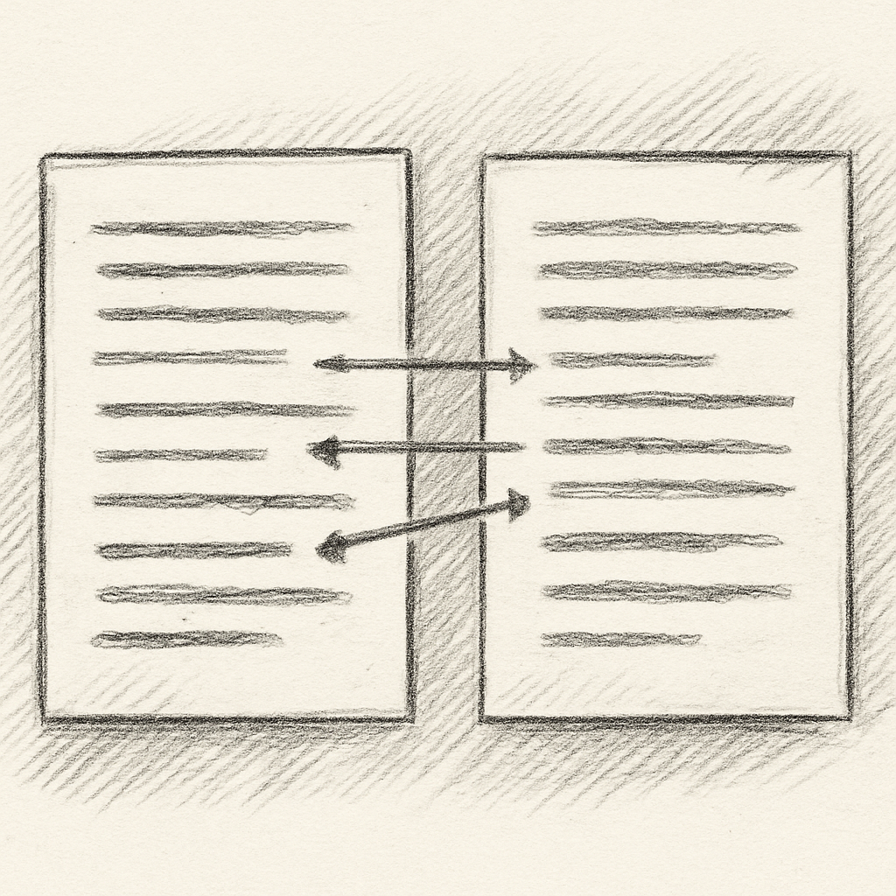
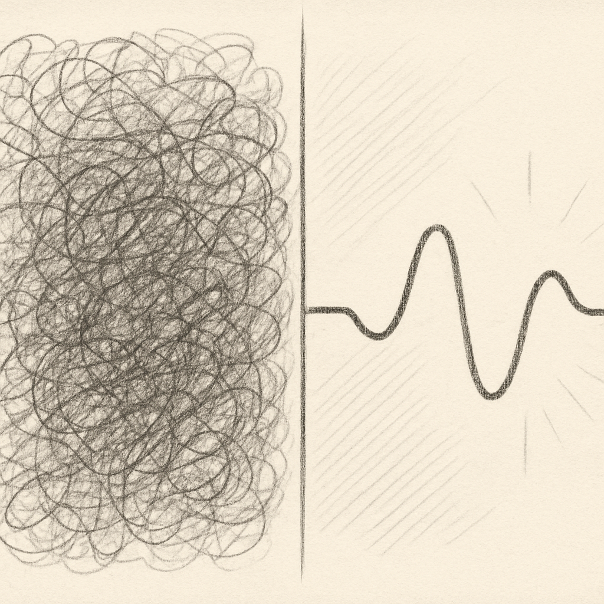
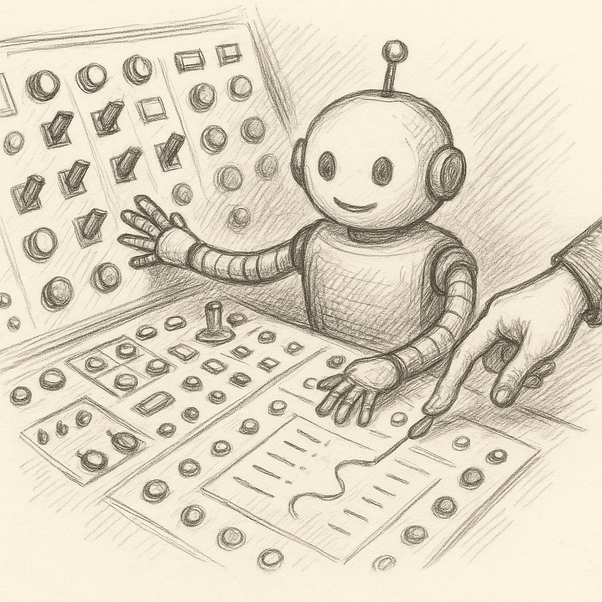
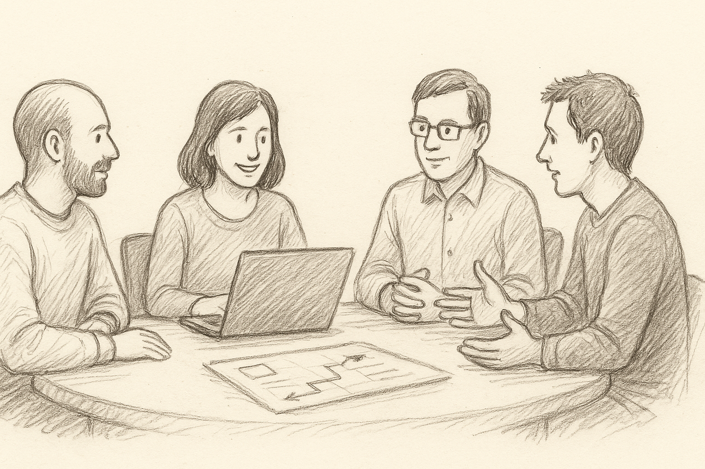

<!-- IMAGE: images/compass.png
IMAGE PROMPT: A hand-drawn pencil illustration of an old brass compass lying on a blank page, clear N-E-S-W markings, light shadow, off-white paper background, no text.
-->

# Real-world Experiences with AI-Assisted Development

- Developer edition
- Vibes, agents, and real code
- Patterns *and* traps we've seen

<!--
NOTES:
Set the tone: “This is a field report, not a hype talk.”

Explain:
- We’ve all used AI for coding by now.
- This talk is about what actually happens in day-to-day work.
- Equal focus on patterns and anti-patterns.

Tie to compass:
“Tools are the engine. We’re still responsible for direction. Today is about sharpening that sense of direction.”
-->

---

<!-- IMAGE: images/lighthouse.png
IMAGE PROMPT: A hand-drawn pencil illustration of a lighthouse on a rocky shore, light beam cutting through clouds, small figures at the bottom looking up, off-white paper background, no text.
-->

## Why talk about this now?

- AI is no longer a toy
- Practices are still fuzzy

<!--
NOTES:
Frame the moment.

Mention:
- AI assistants are in most IDEs and editors now.
- Many teams are using them daily, not as an experiment.
- But our working agreements and practices lag behind.

Point at lighthouse:
“We’re shining light on where AI genuinely helps and where it quietly increases risk.”
-->

---

<!-- IMAGE: images/bridge.png
IMAGE PROMPT: A hand-drawn pencil illustration of a sturdy bridge spanning a gap, small figures walking across, simple clouds in the background, off-white paper background, no text.
-->

## Where we’ll go

- Quick framing
- Patterns that keep you fast *and* safe
- Anti-patterns that quietly hurt you

<!--
NOTES:
Keep this brief.

Emphasize:
- Not a tool comparison.
- We’ll stay tactical: prompts, workflows, code review, agents.
- Aim: 2–3 concrete changes people can try next week.

Bridge metaphor: architects/devs create paths across uncertainty; AI just changes how we build that bridge.
-->

---

<!-- _paginate: false -->

## Who am I?

- Developer
- Author
- [Thoughtworker](https://www.thoughtworks.com)
- [Production-grade software using ~~vibe coding~~ AI-assisted development?](https://www.thoughtworks.com/insights/blog/generative-ai/can-vibe-coding-produce-production-grade-software)
- https://ddd-practitioners.com

<!--
NOTES:
Keep this brief—introduce yourself, establish credibility, then move on.

About me:
- I'm a long-time Thoughtworker at the software consultancy Thoughtworks.
- I play various technology-facing roles: developer, architect, technical lead—whatever the problem needs.
- Author of a book on applying Domain-Driven Design (DDD) in pragmatic, real-world ways.
- Currently writing a second book on Data Architecture.

Connect to the talk:
"I've been working with AI coding assistants since early 2023, on real client projects and internal tools. Today's talk comes from that hands-on experience—the patterns and anti-patterns we're about to cover are things my teams and I have actually lived through."

Point to the article link:
"If you want more depth on the 'vibe coding' experiment, that Thoughtworks article digs into whether AI-generated code can actually ship to production. Spoiler: yes, but with caveats—which is what this talk is about."
-->

---
<!-- IMAGE: images/dev-robot-pair.png
IMAGE PROMPT: Hand-drawn pencil illustration of a software developer and a small friendly robot sitting side by side at a desk, both looking at the same laptop screen, collaborative feel, off-white paper background, no text.
-->

## How we’re using AI today

- Inline suggestions
- Chat and agent-based “vibe coding”
- Spec-driven development?

<!--
NOTES:
Describe the spectrum:

- Inline: Copilot-style completions, boilerplate, API reminders.
- Vibe coding: natural-language “build me X” flows in a chat.
- Agents: tools that edit multiple files, run tests, touch config.

Punchline:
“Across all of these, responsibility hasn’t moved. We still sign off on the change; AI just changes how the change is produced.”
-->

---

<!-- IMAGE: images/map-pencil.png
IMAGE PROMPT: Hand-drawn pencil illustration of a hand holding a pencil over a simple map or blueprint with a clear route marked, off-white paper background, no text.
-->

## Pattern 1 – Start with a clear intent

- One tight paragraph of *what* & *why*
- Call out constraints explicitly

<!--
NOTES:
Core idea: most “hallucination” is underspecified intent.

Suggest prompt structure:
- What you want.
- Where it lives (which module/layer).
- Constraints (language, framework, performance, security).
- Non-goals (“don’t touch auth”, “don’t change DB schema”).

Example:
“Implement a POST /users endpoint in our existing Spring Boot API. Use the existing User entity, don’t touch auth, return 400 on validation errors.”

Line:
“The model doesn’t know your system; it only knows your words. Be generous with intent.”
-->

---

<!-- IMAGE: images/lego-blocks.png
IMAGE PROMPT: Hand-drawn pencil illustration of several simple building blocks stacked in small groups, suggesting modular pieces that can be rearranged, off-white paper background, no text.
-->

## Pattern 2 – Keep asks small

- One function, one test, one endpoint
- Avoid “whole feature in one go”

<!--
NOTES:
Explain why smaller prompts win:

- Big requests introduce ambiguity → fuzzy, incomplete answers.
- Small units are easier to test and review.
- Keeps diffs and rollback manageable.

Example contrast:
Bad: "Build the entire registration flow front to back."
Better: "Implement the email verification step for existing registration flow."

Phrase:
"Think in AI-sized bricks, not full buildings."
-->

---

<!-- IMAGE: images/test-tubes.png
IMAGE PROMPT: Hand-drawn pencil illustration of a simple lab scene: test tubes in a stand and a checklist beside them, symbolizing experiments and tests, off-white paper background, no text.
-->

## Pattern 3 – Let tests & contracts steer

- Start from tests, examples, or types
- Use them as the AI’s fitness function

<!--
NOTES:
Connect to TDD and fitness functions.

Workflow example:
1. Write or have the AI draft tests for a behavior.
2. Tighten the tests.
3. Ask the AI to implement until tests pass.

Call out:
- Types and clear interfaces also act as constraints.
- This works especially well with agentic tools that auto-run tests.

Advanced: Combine with functional style for maximum robustness
When you shape your work as small, pure functions with clear contracts:
- Small: one function does one transformation (easier to test, easier for AI to get right)
- Pure: no hidden state, no I/O in the logic (input → output, that's it)
- Clear contracts: strong types, explicit interfaces

This isn't AI-specific advice—functional programming has advocated this for decades.
But when AI is generating some of your code, these principles compound their value:
* Pure functions are trivial for AI to implement correctly
* Easy to test means your "fitness function" stays fast and reliable
* Easy to review means you catch issues quickly
* Less surface area for subtle bugs to hide

Practical approach:
- Ask AI for the pure transformation first: "write a function that takes X and returns Y"
- Push I/O and side-effects to thin wrappers at the edges
- Keep mutable state and database calls out of your core logic

You don't need to rewrite your entire system.
Start with new features: bias toward stateless transformations when the domain allows it.

The result: more robust programs, whether written by humans or AI.

Line:
"Tests aren't just for humans anymore — they're how we talk to the AI about what 'good' looks like."
-->

---

<!-- IMAGE: images/sculptor-chisel.png
IMAGE PROMPT: Hand-drawn pencil illustration of a sculptor's hands using a small chisel to refine details on a nearly-finished statue, suggesting careful refinement rather than starting over, off-white paper background, no text.
-->

## Pattern 4 – Refine, don't regenerate

- AI gives you *almost* correct code
- Iterate in small steps, don't start over

<!--
NOTES:
Most AI-generated code isn't perfect on the first try—and that's okay.

Real scenario (happened twice last sprint):
- AI writes 80% of what you need
- Small issues: wrong variable name, slightly off logic, missing edge case
- Developer's first instinct: hit regenerate
- Better: spent 30 seconds specifying the fix, got it right immediately

Common scenario:
- AI writes a data validation function with 4 edge cases covered
- Missing: null handling and empty string check
- Temptation: "Let me re-prompt and try again from scratch"

Better approach:
- Ask the AI to fix the specific issue: "Also handle null and empty string"
- Build on what's working rather than throwing it away
- Keep the conversation focused on refinements, not full rewrites
- Result: fixed in 30 seconds vs. 2-3 minutes of re-prompting

When to regenerate instead:
- The AI fundamentally misunderstood your intent
- The approach is architecturally wrong
- You're in an anti-pattern 4 situation (bad thread—see later slide)

Think of it like editing a draft:
"You don't rewrite the whole essay every time you spot a typo."

Key insight:
"The AI's mental model of your problem improves with each exchange.
Iterative refinement builds on that understanding; regeneration throws it away."

Quick decision test:
"Is this fixable with 2-3 targeted corrections, or am I fighting the whole approach?"
If fighting the whole approach → restart fresh.
If just needs tweaks → refine incrementally.
-->

---

<!-- IMAGE: images/diff-view.png
IMAGE PROMPT: Hand-drawn pencil illustration of two sheets of paper side by side with a few highlighted lines connecting between them, representing a code diff, off-white paper background, no text.
-->

## Pattern 5 – Keep changes reviewable

- Small, coherent diffs
- Explainable in one sentence

<!--
NOTES:
Tie to GitHub / PR reality.

Key ideas:
- Constrain prompts so changes stay local.
- Commit in steps: “add validation”, “extract helper”, etc.
- Use PR templates to tag AI-assisted bits.

Example:
“This PR: AI generated the initial handler; I simplified the logic and added tests.”

Punchline:
“AI can write a lot of code quickly. The bottleneck is still human comprehension — optimize for that.”
-->

---

<!-- IMAGE: images/sketch-lab.png
IMAGE PROMPT: Hand-drawn pencil illustration of a messy workbench with sketches, sticky notes, and a coffee mug, giving a prototype “lab” feel, off-white paper background, no text.
-->

## Pattern 6 – Spike with vibes, then sanitize

- Vibe-code spikes are fine
- Rewrite anything that survives

<!--
NOTES:
Make vibe coding situational, not forbidden.

Explain:
- Use full-on vibe mode for exploration: prototypes, “could this work?” ideas.
- Treat spike code as disposable.
- If it becomes real, re-implement or refactor with tests and structure.

Story:
Share a “weekend project that escaped into prod” and the pain that followed vs. a deliberate rewrite.

Line:
“Let AI help you find the shape of the solution. Just don’t confuse the sketch with the final drawing.”
-->

---

<!-- IMAGE: images/tangled-yarn.png
IMAGE PROMPT: Hand-drawn pencil illustration of a tangled ball of yarn with threads going in many directions, off-white paper background, no text.
-->

## Anti-pattern 1 – Vague, multi-ask prompts

- “Do everything” instructions
- No context, no constraints

<!--
NOTES:
Reinforce the opposite of Pattern 1 & 2.

Examples:
- “Make a login system with metrics and tests.”
- “Modernize this service and add observability.”

Typical outcome:
- The AI picks defaults that don’t fit your stack.
- It forgets parts of the ask.
- You spend time untangling (point at yarn).

Smell:
Lots of “and also…” in one prompt.
-->

---

<!-- IMAGE: images/excavator-building.png
IMAGE PROMPT: Hand-drawn pencil illustration of a large excavator or bulldozer awkwardly parked next to a delicate building, suggesting overpowered tools for a precise job, off-white paper background, no text.
-->

## Anti-pattern 2 – One-shot repo surgery

- Agents touching dozens of files
- Hard to review or roll back

<!--
NOTES:
Paint the scenario:

- “Migrate everything to framework X.”
- Agent changes 40 files, configs, build scripts.
- Reviewers are overwhelmed; subtle breakages appear later.

Recommend:
- Limit scope: one module or feature at a time.
- Human checkpoints between agent runs.

Line:
“Use the excavator for the parking lot, not for adjusting the picture frames inside the house.”
-->

---

<!-- IMAGE: images/noise-vs-signal.png
IMAGE PROMPT: Hand-drawn pencil illustration split in two: on the left a chaotic wall of scribbles, on the right a single clear signal wave or beam, off-white paper background, no text.
-->

## Anti-pattern 3 – Context stuffing

- “Here’s 20 files, just in case”
- Signal buried under noise

<!--
NOTES:
Explain why "more context" isn't automatically better:

- Models have a limited window and attention.
- Irrelevant code dilutes important code.
- Prompts become slower and less accurate.

Important distinction:
This anti-pattern is about MANUAL context selection—when YOU choose what to include.
Many modern AI coding tools (Claude Code, Cursor, etc.) auto-select context using embeddings and codebase analysis.
That's usually fine—the tools are designed to pull relevant files.

The trap is when YOU manually add files "just in case":
- Copying 20 files into a chat window
- Pasting entire modules when only one function matters
- Including tangentially related code "for background"

Practical tips:
- Trust tool-based context selection (but spot-check that it grabbed the right files)
- When manually adding context: only include files actually touched by the change
- If unsure what's relevant, first ask: "Which files matter for X?" then start a new, clean thread with just those

Analogy:
"It's like answering a simple question while someone hands you their entire filing cabinet."
-->

---

<!-- IMAGE: images/loop-arrow.png
IMAGE PROMPT: Hand-drawn pencil illustration of a person walking in a small circular path marked by arrows, looking confused, off-white paper background, no text.
-->

## Anti-pattern 4 – Staying in a bad thread

- Conversation stuck in wrong framing
- You keep patching instead of restarting

<!--
NOTES:
Talk about sunk-cost with chats.

This is surprisingly common—I've watched multiple developers (including myself) do this:
- First response is 70% right
- Second attempt drifts to 60%
- By the fifth try, we're further from the goal than attempt #1
- Pattern: prompts getting longer and more desperate

Signs you're in a bad thread:
- AI keeps repeating wrong assumptions.
- Prompts get longer and more defensive.
- Answers feel increasingly off.
- You're explaining the same constraint for the third time.

Advice:
- Don't be sentimental; start a fresh chat.
- Copy only the clarified requirements, not the whole history.
- Treat it like a do-over with better information.

Line:
"Sometimes the most productive thing you can do is close the tab and start over."
-->

---

<!-- IMAGE: images/red-flag.png
IMAGE PROMPT: Hand-drawn pencil illustration of a prominent warning flag planted next to a sheet of code or an abstract document, off-white paper background, no text.
-->

## Anti-pattern 5 – Blind copy-paste

- Code pasted without review
- No tests, no run, no understanding

<!--
NOTES:
Probably the most important anti-pattern—and the most common.

Seen in the wild:
- Junior dev pasted an AI-generated authentication function
- Compiled fine, tests passed (tests were also AI-generated)
- Code review caught: password comparison using == instead of timing-safe comparison
- Would've been a security vulnerability in production

More stories:
- AI-generated code that compiled but had subtle logic bugs.
- Security smells: unsafe SQL, naive crypto, hardcoded secrets.
- Off-by-one errors in loops that only triggered with specific data.

The pattern:
Developer trusts that "it compiles and runs" means "it's correct."
But AI can generate plausible, working code with subtle flaws.

Guidelines:
- Always read AI-generated code you commit.
- Run it. Add or update tests.
- If it's too complex to understand, ask the AI to simplify.
- Pay extra attention to: security, edge cases, error handling.

Line:
"You're still accountable for this code in production, regardless of who typed it."
-->

---

<!-- IMAGE: images/robot-control-panel.png
IMAGE PROMPT: Hand-drawn pencil illustration of a complex control panel with many switches and a cute robot reaching for all of them at once, a human hand nearby about to stop it, off-white paper background, no text.
-->

## Anti-pattern 6 – Over-trusting agents

- No boundaries on what they can touch
- Tests, config, commits all on autopilot

<!--
NOTES:
Differentiate “helpful agent” from “unsupervised agent”.

Examples:
- Agents that “fix tests” by deleting them.
- Config changes that work locally but break CI/prod.

Recommendations:
- Restrict what agents can modify in one run.
- Require human approval for commits/merges/deploys.
- Use agents for repetitive edits, not architectural decisions.

Line:
“Today’s agents are powerful, not wise. Wisdom still has to come from us.”
-->

---

<!-- IMAGE: images/puzzle-fit.png
IMAGE PROMPT: Hand-drawn pencil illustration of a few puzzle pieces coming together to form a simple shape, off-white paper background, no text.
-->

## Putting it together

- Use AI where speed helps
- Keep humans owning intent & acceptance

<!--
NOTES:
Synthesize without re-listing everything.

Three roles for humans:
- Decide what’s worth building (intent).
- Shape boundaries: modules, contracts, tests.
- Accept or reject changes.

Connect to puzzle:
“AI is one more powerful piece. It only works when it locks into a clear structure around it.”
-->

---

<!-- IMAGE: images/team-table.png
IMAGE PROMPT: Hand-drawn pencil illustration of three or four people sitting around a table having a discussion, with a laptop visible, collaborative team feel, off-white paper background, no text.
-->

## Team agreements matter

- Review practices for AI-assisted code
- Support for developers at different levels

<!--
NOTES:
Up to now, we've focused on individual developer practices.
But AI assistance changes team dynamics—let's talk about that.

Three key team considerations:

1) How to review AI-assisted PRs from teammates:
- Don't assume AI code is "pre-reviewed" or automatically correct
- Look for the same things you'd look for in human code: logic, edge cases, security
- If the diff is too large to review effectively, push back (Pattern 5)
- Ask: "Can you walk me through the AI-generated parts?" in PR comments

2) Supporting developers with varying AI reliance:
- Observed pattern: junior devs sometimes over-rely without understanding fundamentals
- Also observed: senior devs can be overly skeptical and miss genuine productivity gains
- One team experiment: pair sessions where one prompts, one reviews (both learned)
- Create space for learning: pair programming sessions where one person prompts AI, the other reviews
- Share good prompts and workflows that worked (just like sharing good code patterns)

3) Building shared understanding:
- Make AI usage visible, not hidden: "I used AI for the boilerplate, wrote the business logic myself"
- Share "this worked well" and "this went badly" stories in retros
- Document team-specific patterns (your domain, your stack, your constraints)

The goal isn't uniformity:
Not everyone needs to use AI the same way.
The goal is shared expectations about quality and review standards.

Punchline:
"AI tools are individual, but code quality is a team responsibility.
Make sure your team agreements reflect that."
-->

---

<!-- IMAGE: images/checklist.png
IMAGE PROMPT: Hand-drawn pencil illustration of a clipboard with a short checklist and a pencil, a couple of items ticked, off-white paper background, no text.
-->

## What to try next week

- Pick one pattern → add to team practice
- Call out one anti-pattern in reviews

<!--
NOTES:
Make it actionable without being prescriptive.

How to formalize a pattern:
- Add to PR template ("How did AI help? Which patterns did you use?")
- Include in onboarding docs or team README
- Discuss in sprint retros: "What AI patterns worked well this week?"

How to retire an anti-pattern:
- Call it out explicitly in code reviews when you see it
- Add to team's definition of done
- Share examples (anonymized) in team meetings

Concrete examples teams could try (pick what fits YOUR context):

Patterns to codify:
- "AI-generated code must include tests" in your PR checklist
- "Keep AI changes under 5 files per PR" as a guideline
- "Ask AI for implementation plan before code" for complex features
- "Start from tests" when using AI for new logic

Anti-patterns to call out:
- Label "blind copy-paste" as a review red flag
- Team agreement: if stuck in a bad thread, restart fresh
- No agent changes to >10 files without human checkpoint

Start small:
Don't try to implement all 6 patterns and avoid all 6 anti-patterns.
Pick the ONE pattern that would help most and ONE anti-pattern that's hurting most right now.

Encourage experimentation:
"Try it for two weeks. If it doesn't fit your workflow, adjust or drop it.
The goal is better outcomes, not policy compliance."

Punchline:
"You don't need a comprehensive AI policy framework to start.
A couple of good habits, consistently applied, already move the needle."
-->

---

<!-- IMAGE: images/questions.png
IMAGE PROMPT: Hand-drawn pencil illustration of two people standing and talking, with a couple of question marks lightly sketched above them, off-white paper background, no text.
-->

## Q & A

- Stories, questions, disagreements welcome

<!--
NOTES:
Invite conversation.

Good prompts:
- “What’s the best thing your assistant has done for you?”
- “What’s the scariest thing it’s done?”
- “Which pattern or anti-pattern feels most relevant in your team?”

Use their stories to reinforce that everyone is still figuring this out together.
-->